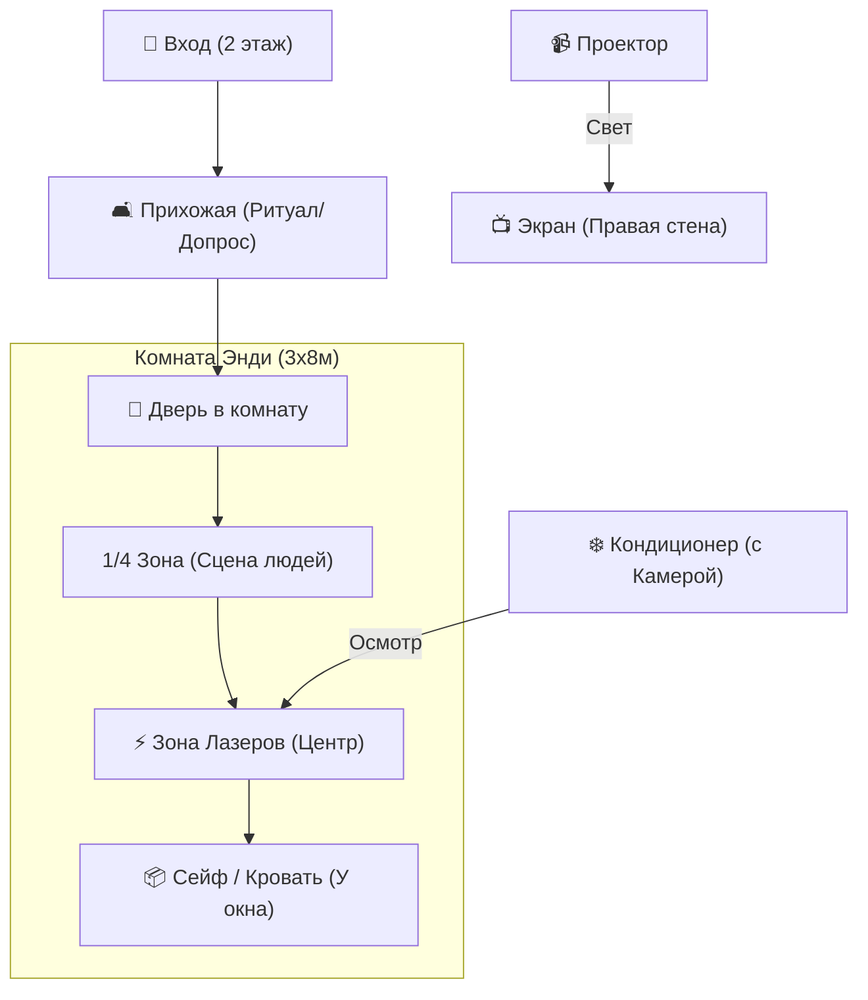

# Гид Стейдж-Менеджера: Универсальный Протокол (v4.0)

Этот документ предназначен для человека, контролирующего «закулисье». Ваша цель: 100% бесшовность для детей.

---

## 1. ПЛАН ЗАЛА (3 x 8 метров)

---

## 2. ГРАФИК ОПЕРАЦИЙ

| Тайминг | Локация | Задача Команды | Состояние детей |
| :--- | :--- | :--- | :--- |
| **10:00-10:15** | Улица | Солдатики развлекают. Рекс выбегает. | Знакомство / Паника |
| **10:15-10:25** | Прихожая | Базз рисует маркировку. | Трансформация |
| **10:25-10:35** | Комната | Мама и Энди играют сцену. | Невидимые свидетели |
| **10:35-10:50** | **ХОЛЛ** | **МОНТАЖ ЛАЗЕРОВ (15 мин в тишине!)** | Допрос свидетелей |
| **10:50-11:10** | Комната | Оператор следит за нитками через камеру. | Лазерный квест |
| **11:10-11:35** | Комната | Смена видео на Собаку Скуда. | Стелс-коробка |
| **11:35-12:15** | Комната | Выключить основной свет. Только УФ. | Поиск Истины |

---

## 3. ЧЕК-ЛИСТ «ОБСЕССИВНАЯ ДЕТАЛИЗАЦИЯ»

### ПОДГОТОВКА (До 10:00):
- [ ] **Камера:** Проверить stream с телефона на кондиционере на ноутбук оператора.
- [ ] **Нитки:** Заготовлено 10 отрезков с кусками малярного скотча на концах (для быстрого монтажа).
- [ ] **Батарейки:** 10 картонных батареек спрятаны в коробке с газетами.
- [ ] **Сейф:** Код "ПРАВДА" написан УФ-маркером на 3-х разных стенах.
- [ ] **Звук:** Проверить звук "Поворота ключа" в 10:35. Это КРИТИЧЕСКИЙ сигнал для актеров.

### МОНТАЖ (10:35 - 10:50):
*Нужно 3 человека внутри комнаты:*
1. **Первый:** Тянет верхние 5 ниток.
2. **Второй:** Тянет нижние 5 ниток.
3. **Третий:** Раскидывает мусор (газеты) и батарейки.
*   **Тишина:** Дети стоят за дверью. Если услышат шум скотча — магия разрушится. Используйте это время, пока Солдатики в холле проводят "Громкую тренировку".

### ФИНАЛ:
- [ ] Приготовить подарки в холле к 11:50.
- [ ] Вывести слайды с историей Тараза на экран ровно после открытия сейфа.
